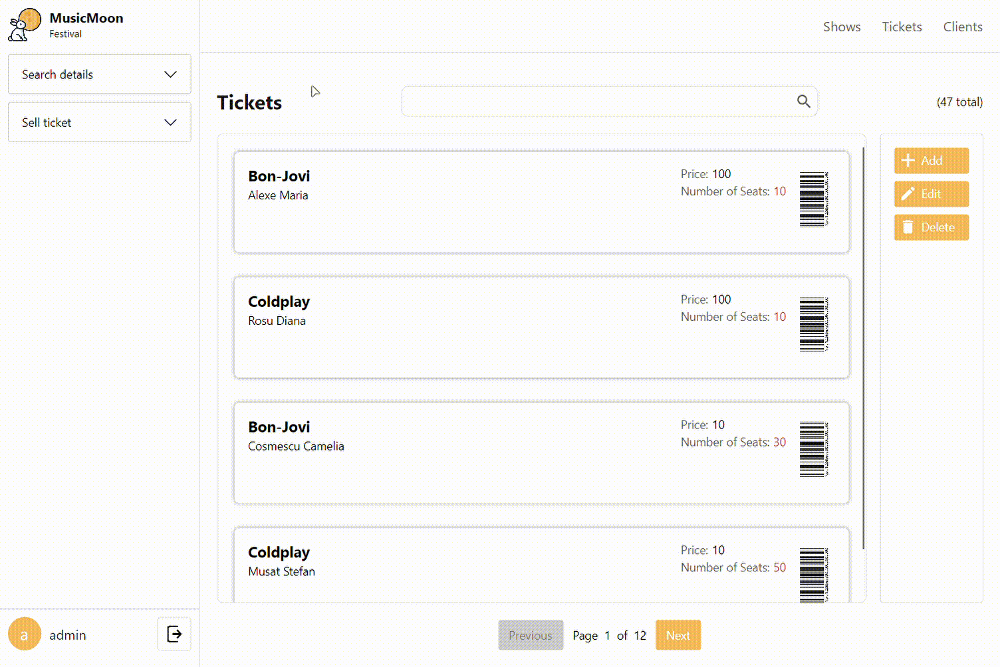

# MusicMoon Festival - Client-Server Application

A .NET-based client-server application for managing a music festival, featuring both TCP and SignalR communication protocols.

## 🎯 Project Overview

This application is designed to manage various aspects of a music festival, including:

- Employee management
- Client management
- Show scheduling
- Ticket sales and management

The system uses a multi-layered architecture with both TCP and SignalR communication protocols for real-time updates.

## 📸 Screenshots

### Login Window


**Description**: The login window allows employees to access the system. Enter your credentials and click "Login" to authenticate. The system verifies employee credentials against the database.

### Main Window


**Description**: The main interface after successful login. From here, you can access all functionalities:

- Search for shows by various criteria
- Sell tickets
- Manage employees, clients, and shows
- View real-time statistics

### Search Details Dropdown


**Description**: Use this dropdown to select specific search criteria for shows:

- Search by artist name (enter artist name)
- Search by hour (HH:mm - select date range)
- Click "Search" to filter results according to selected criteria

### Search Results


**Description**: Results are displayed in a table format showing:

- Show date and time
- Artist name
- Available seats (updates in real-time)
- Sold seats (updates in real-time)
- Select a show and click "Sell Ticket" to proceed to the ticket selling interface

### Selling Ticket Functionality


**Description**: The ticket selling interface allows employees to:

1. Write down the client's name
2. Enter the number of seats to sell to that client
3. Click "Sell" to complete the transaction

**Real-time Feature**: When a ticket is sold, the available and sold seats count updates instantly across all connected clients. Multiple employees can sell tickets simultaneously while seeing accurate seat availability.

## 🎬 Demo Video

### Search and Pagination Demo



**Features Demonstrated:**

- Debounced search functionality for optimal performance
- Real-time search using various filters
- Pagination for managing large result sets
- Responsive UI updates as search criteria change
- Smooth transitions between result pages

## 🏗️ Architecture

The project is structured into several key components:

- **FestivalMuzica.Client**: The client application that provides the user interface
- **FestivalMuzica.Server**: The server application that handles business logic and data persistence
- **FestivalMuzica.Networking**: Contains networking-related code and protocols
- **FestivalMuzica.Common**: Shared models and interfaces used across the application

## 🚀 Features

- Real-time updates using SignalR
  - Available and sold seats are synchronized in real-time across all connected clients
  - Multiple users can view and purchase tickets simultaneously
  - Instant updates when tickets are sold or modified
- TCP-based communication for core operations
- Database persistence for all entities
- Multi-user support
- Comprehensive logging system

## 🛠️ Technologies Used

- .NET Core
- SignalR for real-time communication
- TCP/IP for core networking
- Entity Framework Core (based on repository pattern)
- Microsoft.Extensions for dependency injection and configuration
- ASP.NET Core for SignalR hosting

## 📋 Prerequisites

- .NET 9.0 for Windows
- SQL Server (or compatible database)
- Visual Studio 2022 (recommended) or VS Code

## 🔧 Installation

1. Clone the repository:

```bash
git clone [repository-url]
```

2. Navigate to the project directory:

```bash
cd mpp-proiect-csharp-Ianthe23
```

3. Restore NuGet packages:

```bash
dotnet restore
```

4. Configure the database connection string in `FestivalMuzica.Server/appsettings.json`

5. Build the solution:

```bash
dotnet build
```

## 🚀 Running the Application

1. Start the server:

```bash
cd FestivalMuzica.Server
dotnet run
```

2. Start the client:

```bash
cd FestivalMuzica.Client
dotnet run
```

## 📁 Project Structure

```
mpp-proiect-csharp-Ianthe23/
├── FestivalMuzica.Client/        # Client application
├── FestivalMuzica.Server/        # Server application
├── FestivalMuzica.Networking/    # Networking components
├── FestivalMuzica.Common/        # Shared models and interfaces
└── mpp-proiect-csharp-Ianthe23.sln  # Solution file
```

## 🔐 Configuration

The server requires configuration in `appsettings.json`:

- Database connection string
- Server ports for TCP and SignalR
- Logging configuration
